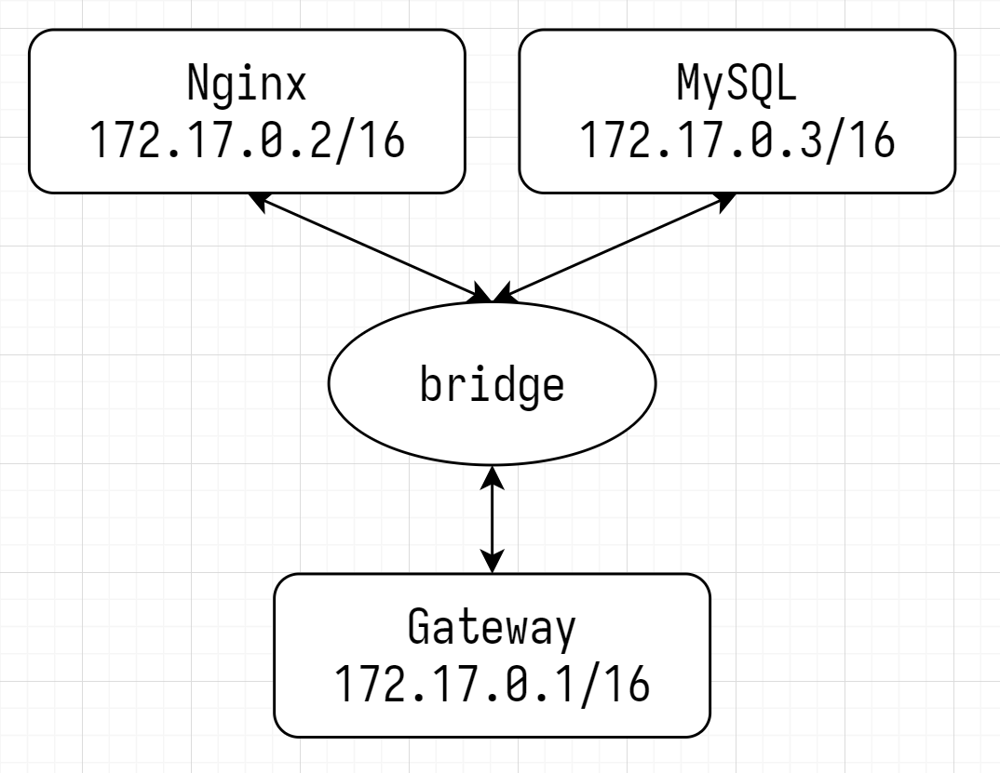

# Git & Docker

## Git

```shell
git config --global user.name Tiancheng && \
git config --global user.email 'yukino161043261@gmail.com' && \
git config --global core.autocrlf false && \
git config --global credential.helper store && \
git config --global init.defaultBranch main && \
git config --global core.filemode false
ssh-keygen -t rsa -C 'yukino161043261@gmail.com'
```

```shell
git init                         # 初始化空git仓库
ls [-a] | ll [-a]                # 查看文件
git status                       # 查看状态
cat <filename>                   # 查看文件
git add <filename>               # 将工作区的文件添加到暂存区
git rm -r --cached <filename>    # 删除暂存区的文件
git commit -m <message> [<file>] # 将暂存区的文件提交到本地库
git log                          # 日志
git reflog                       # 查看版本
git reset --hard <version>       # 版本穿梭
git branch -v                    # 查看分支
git branch <branchName>          # 创建分支
git checkout <branchName>        # 切换分支
git merge <branchName>           # 合并分支（冲突合并，手动解决冲突后提交时不带文件名）
```

冲突合并：合并分支时，两个分支对同一文件的同一位置有不同的修改。应手动解决冲突

```shell
git remote -v                          # 查看别名
git remote add <alias> <remoteRepoURL> # 创建别名（通常alias = origin）
git push <alias> <branchName>          # 推送
git push --set-upstream origin main    # Initial commit
git clone <remoteRepoURL>              # 克隆（拉取代码、初始化本地仓库、创建别名origin）
```

模块

```shell
git submodule add <submodule_url>
git clone <mainmodule_url> --recurse-submodules
git submodule init
git submodule update
git submodule update --init --recursive
```

撤销

```shell
# 未使用git add缓存代码

git checkout -- <filepath>
git checkout . # 撤销所有修改

# 已使用git add缓存代码，未使用git commit提交代码

git reset HEAD <filepath> && git checkout -- <filepath>
git reset HEAD && git checkout . # 撤销所有修改

# 已使用git commit提交代码

git reset --hard HEAD^    # 回退到上一个版本
git log                   # 查看历史版本
git reset --hard commitid # 回退到历史版本
git revert HEAD           # 创建新提交，撤销上一个提交
```

## Docker

- 镜像 Image
- 容器 Container
- 数据卷 Volume

```sh
docker pull nginx                       # 拉取 nginx 镜像
docker images                           # 查看所有镜像
docker save -o ./nginx.tar nginx:latest # 导出 nginx 镜像
docker rmi nginx:latest                 # 删除 nginx 镜像
docker load -i ./nginx.tar              # 加载 nginx 镜像

# docker run [OPTIONS] IMAGE [COMMAND] [ARG...]
# -p Publish a container's port(s) to the host
docker run --detach --name nginx -p 80:80 nginx # 创建容器
docker ps [-a]                                  # 查看（所有）容器
docker start nginx                              # 启动 nginx 容器
docker logs --follow nginx                      # 查看 nginx 容器的日志

# 拉取mysql镜像并创建mysql容器
docker run -d --name mysql -p 3306:3306 -e TZ=Asia/Shanghai -e MYSQL_ROOT_PASSWORD=0228 mysql

# docker exec [OPTIONS] CONTAINER COMMAND [ARG...]
docker start nginx         # 启动 nginx 容器
# -i, --interactive; -t, --tty A pseudo-TTY
docker exec -it nginx bash # 进入 nginx 容器
docker stop mysql          # 终止 nginx 容器
docker rm mysql [--force]  # 删除 nginx 容器

# -v, --volumn Bind mount a volume
docker run -d --name nginx -p 80:80 -v html:/usr/share/nginx/html nginx
docker volume ls           # 列出所有数据卷
docker volume inspect html # 查看 html 数据卷
docker volume rm html      # 删除 html 数据卷
docker volume prune        # 删除未使用的数据卷
# ========== MacOS ==========
# docker run -it --privileged --pid=host debian nsenter -t 1 -m -u -n -i sh
# cd /var/lib/docker/volumes

# ========== Windows ==========
# cd \\wsl$\docker-desktop-data\data\docker\volumes

docker inspect nginx # 查看 nginx 的镜像、容器、数据卷

docker run -d --name mysql -p 3306:3306 -e TZ=Asia/Shanghai -e MYSQL_ROOT_PASSWORD=0228 \
-v ./volume/mysql/data:/var/lib/mysql \
-v ./volume/mysql/init:/docker-entrypoint-initdb.d \
-v ./volume/mysql/conf:/etc/mysql/conf.d mysql # 挂载 mysql

docker run -d --name nginx -p 80:80 -v ~/volume/nginx/html:/usr/share/nginx/html nginx # 挂载nginx
```

### Dockerfile

| 指令       | 说明                     | 例                              |
| ---------- | ------------------------ | ------------------------------- |
| FROM       | 指定基础镜像             | FROM openjdk:21-jdk-slim-buster |
| ENV        | 设置环境变量             | ENV key=value                   |
| COPY       | 拷贝文件到容器的指定目录 | COPY ./a.tar.gz /tmp/           |
| RUN        | 执行 shell 命令          | RUN tar -xzf /tmp/a.tar.gz      |
| ENTRYPOINT | 启动命令                 | ENTRYPOIN                       |

```sh
cd ~/demo && ls # Dockerfile demo.jar
cat ./Dockerfile
# FROM openjdk:21-jdk-slim-buster
# ENV TZ=Asia/Shanghai
# RUN ln -snf /usr/share/zoneinfo/$TZ /etc/localtime && echo $TZ > /etc/timezone
# COPY ./demo.jar /app.jar
# ENTRYPOINT ["java", "-jar", "/app.jar"]

docker build -t demo:1.0 ./ # docker build -t demo:1.0 /home/user/demo
docker images
docker run -d --name demo -p 8080:8080 demo:1.0
docker ps -a
curl localhost:8080/hello
```

- 网桥：网段内转发
- 路由器：网段间转发

默认网络 bridge



```sh
docker inspect nginx | grep -i Gateway   # 172.17.0.1/16
docker inspect nginx | grep -i IPAddress # 172.17.0.2/16

docker inspect mysql | grep -i Gateway   # 172.17.0.1/16
docker inspect mysql | grep -i IPAddress # 172.17.0.3/16

ping -c 4 172.17.0.1                     # Success
```

默认网络 bridge

| 命令                                                  | 说明             |
| ----------------------------------------------------- | ---------------- |
| doccker network create [OPTIONS] NETWORK              | 创建某网络       |
| docker network ls                                     | 列出所有网络     |
| docker network inspect [OPTIONS] NETWORK [NETWORK...] | 查看某网络       |
| docker network rm NETWORK [NETWORK...]                | 删除某容器       |
| docker network prune                                  | 删除未使用的网络 |
| docker network connect [OPTIONS] NETWORK CONTAINER    | 某容器加入某网络 |
| docker network disconnect [OPTIONS] NETWORK CONTAINER | 某容器离开某网络 |

```sh
docker network ls
docker network inspect bridge  # "Name": "bridge", "Gateway": "172.17.0.1"

docker network create segment
docker network inspect segment # "Name": "segment", "Gateway": "172.18.0.1"

docker network connect segment mysql
docker inspect mysql | grep -i IPAddress # 172.17.0.3, 172.18.0.2

docker network disconnect bridge mysql
docker inspect mysql | grep -i IPAddress # 172.18.0.2

docker rm -f nginx
# 创建 nginx 容器时指定网络
docker run -d --name nginx -p 80:80 -v ~/volume/nginx/html:/usr/share/nginx/html --network segment nginx
docker exec -it nginx bash

# apt update && apt install inetutils-ping net-tools
ping -c 4 172.18.0.2 # Success
ping -c 4 mysql      # Success
```

```shell
# RabbitMQ
docker run -it --rm --name rabbitmq -p 5672:5672 -p 15672:15672 rabbitmq:latest
```
